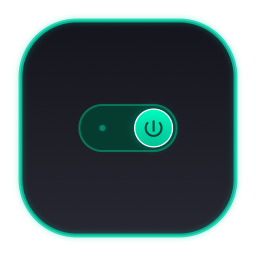

# TinySwitch 🟢🟡🔴

<p align="center">
  
</p>

<p align="center">
  <b>A native macOS menu bar app for managing local Tinygrad LLM servers on eGPUs.</b>
</p>

<p align="center">
  
  &nbsp;&nbsp;&nbsp;&nbsp;
  
  &nbsp;&nbsp;&nbsp;&nbsp;
  
</p>

---

## 🎬 How to Use (User Guide)

TinySwitch is built to be simple and accessible for developers and non-developers alike:

1.  **Toggle the Server:** 
    *   **Left-Click (Normal Click)** the toggle switch icon in your macOS status menu bar to turn the server on or off.
    *   Once clicked **ON**, the icon changes to **Connecting (Yellow)** while the model weights load into the eGPU's VRAM.
    *   When the server is fully ready to accept local requests, the icon turns **Online (Green)**.
    *   Click the icon again at any time to instantly kill the server and free up your system resources (**Offline (Red)**).
2.  **Access Settings:**
    *   **Right-Click (or Control-Click)** the menu bar toggle switch to open the dropdown menu.
    *   Click **Settings...** to open the preferences window.
3.  **Configure Preferences:**
    *   **Tinygrad Path:** Enter or browse to your local Tinygrad installation directory.
    *   **Models Folder:** Click the **Browse...** button to select the directory where your `.gguf` model files are stored. The **Active Model** dropdown will dynamically scan and populate with all available model files.
    *   **Device Flags:** Choose between native Apple Metal execution (`DEV=METAL`) or Docker-routed NVIDIA eGPU runtime (`DEV=NV`).
    *   **Max Context Length:** Select your desired token context ceiling. Setting this will automatically keep your VS Code Copilot/Chat settings file in sync.
    *   Click **Save Settings** to persist your configurations.

---

## 🚀 The Origin Story

TinySwitch is a prime demonstration of advanced agentic development and human-AI collaboration. The application's architecture, feature roadmap, and user experience were directed entirely by a human Product Architect who defined the operational constraints, engineered the functional requirements, and executed rigorous end-to-end quality assurance (QA) and system testing.

While the underlying execution blocks—encompassing native Swift UI patterns, POSIX process management routines, and structural JSON transformations—were synthesized entirely via AI orchestration, the application's real-world resilience is the direct product of continuous human-in-the-loop performance validation, exploratory edge-case testing, and aggressive iterative refinement.

---

## 🌟 Core Features

### 1. 3-State Status Indicator (Red / Yellow / Green)
TinySwitch uses a 3-state machine to let you know exactly what your local server is doing:
*   🔴 **OFF (Red Switch):** The background process is dead, and no hardware resources are being used.
*   🟡 **CONNECTING/LOADING (Yellow Switch):** The background task is active, and the model weights are loading into eGPU VRAM. The server is not yet ready for requests.
*   🟢 **CONNECTED (Green Switch):** The local server is fully active and accepting `/v1/chat/completions` API queries.

### 2. Automatic VS Code Configuration Sync
TinySwitch automatically keeps your VS Code configuration file (`~/Library/Application Support/Code/User/chatLanguageModels.json`) in sync:
*   **Model Context Mapping:** Automatically maps your active model to safe hardware context ceiling limits:
    *   *Heavy 35B Models* ➔ default to **8192** tokens.
    *   *Faster Smaller Models* ➔ default to **4096** tokens.
*   **Target Configuration:** Safely parses your VS Code JSON file, updates token values (`maxInputTokens`, `maxOutputTokens`, `maxTokens`, `contextWindow`), and ensures the URL is strictly outputted as `http://localhost:8000/v1/chat/completions` for stability.
*   **Atomic Mutations:** Prevents file corruption by writing changes atomically and with pretty-printed indentation.

### 3. Graceful Background Process Control
*   Spawns background processes using a login shell (`/bin/zsh -c`) to naturally inherit your local environment path setup (including standard paths like Homebrew, CUDA/`nvcc`, and local bins).
*   Uses process group signaling (`kill(-pid, SIGTERM)`) to ensure that all spawned sub-processes are terminated cleanly without leaving orphaned processes behind.

---

## ⚡ Optimizations

### 1. Prefill Chunking & Throttling (eGPU Power Spike Fix)
To prevent the eGPU from crashing due to sudden power delivery spikes over Thunderbolt (caused by IDEs like VS Code Copilot sending massive 1,500+ token system prompts on the first request), TinySwitch runs an optimized generation pipeline:
*   **Chunked Prefill:** Automatically splits large prompt ingestions exceeding 256 tokens into chunks of 512 tokens.
*   **Micro-Throttling:** Introduces explicit hardware synchronization (`Device.default.synchronize()`) and a 20ms micro-sleep between chunks to allow the Thunderbolt power delivery to stabilize between compute bursts.

---

## ⚠️ Troubleshooting & Known Issues

During the development of TinySwitch, we encountered and resolved several real-world hardware and framework hurdles:

### 1. The Thunderbolt VRAM Bottleneck
*   **The Issue:** Running models that exceed the physical VRAM size of your GPU causes the GPU driver to swap memory pages back and forth over the Thunderbolt cable. Due to the limited bandwidth of Thunderbolt 3/4 compared to PCIe slots, generation speed drops drastically to ~5 tokens/s.
*   **The Solution:** Monitor your model size. Choose weights that fit comfortably within your graphics card's physical memory footprint (e.g. use quantized models) to ensure generation remains local, fast, and high-performance.

### 2. Hardware Lock Collisions
*   **The Issue:** When a model execution fails or exits abruptly, tinygrad or the GPU interface driver can sometimes leave a zombie `nv_usb4.lock` file behind. This locks up consecutive processes, preventing the server from starting up or accessing the eGPU.
*   **The Solution:** Terminate any remaining zombie processes and delete the lock file. Run these commands in your macOS Terminal:
    ```bash
    pkill -9 -f tinygrad
    rm -f /tmp/nv_usb4.lock
    ```

### 3. Token Size Mismatches
*   **The Issue:** Sending a prompt context payload that exceeds a model's native context limit (e.g., trying to send 8192 tokens to a 4096-limit model) causes an internal array reshape crash in Tinygrad, killing the server.
*   **The Solution:** TinySwitch automatically updates the token ceilings in your VS Code `chatLanguageModels.json` whenever you select a model or context length. This prevents VS Code from sending payloads that are too large, keeping your server running smoothly.

### 4. eGPU Power Spikes & Prompt Prefill Throttling
*   **The Issue:** Large initial prompt payloads (such as the 1,500+ token hidden system prompts sent by VS Code Copilot) cause instantaneous compute spikes that trip the eGPU/Thunderbolt power delivery limits, leading to a `RuntimeError: Device fault detected` hardware disconnection.
*   **The Solution:** We implemented **Prefill Throttling & Chunking** in the tinygrad LLM generation layer: if the prefill context exceeds 256 tokens, it is split into chunks of 512 tokens with explicit hardware synchronization (`Device.default.synchronize()`) and a 20ms sleep between chunks to smooth out the power draw. Additionally, the server wraps generation in a try-except to catch device faults and automatically restart the API server process cleanly, preventing zombie Python threads.

---

## 🛠️ Build & Installation

Ensure you have Xcode Command Line Tools installed.

1.  Compile and deploy:
    ```bash
    chmod +x build.sh
    ./build.sh
    ```
2.  Apply ad-hoc code signing to avoid Gatekeeper blocks:
    ```bash
    codesign --force --deep --sign - ~/Applications/TinySwitch.app
    ```
3.  Launch:
    ```bash
    open ~/Applications/TinySwitch.app
    ```
